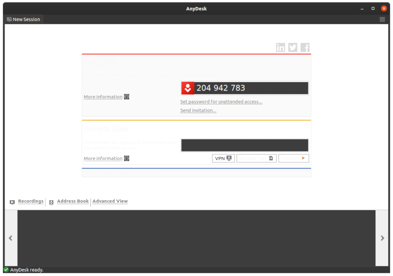
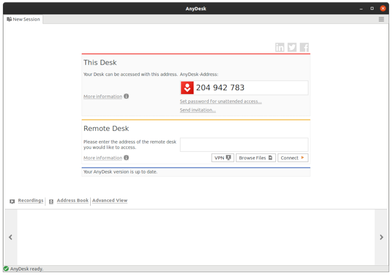

# fix-anydesk-theme

Fix AnyDesk on Gnome environments when using dark themes.

> Note: It only works with the default themes of your distribution, such as Adwaita or Yaru.

## How to use

Run the `anydesk.sh` script by cloning this repository or downloading it directly via Wget:

```
wget https://raw.githubusercontent.com/pauloimon/fix-anydesk-theme/master/anydesk.sh
```

> Make sure that the script has execute permission before running it.

## Screenshots

### Before fix



### After fix


